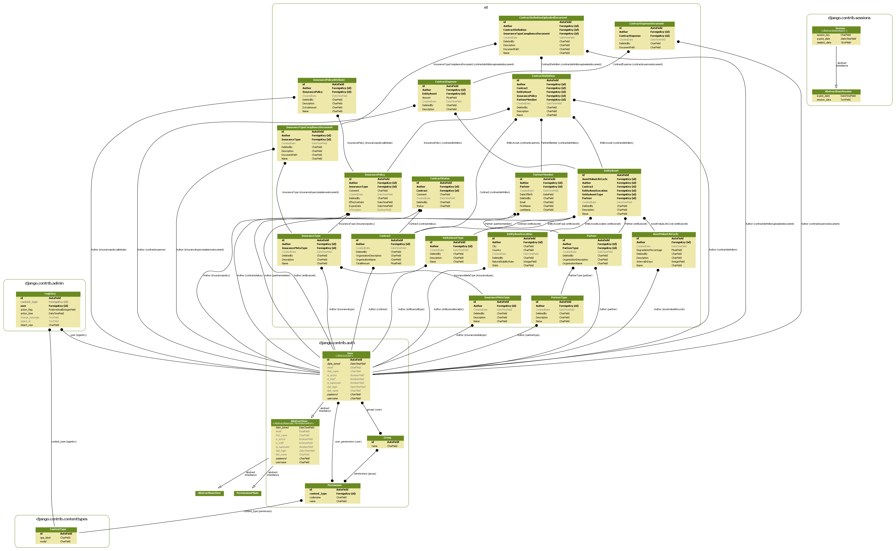
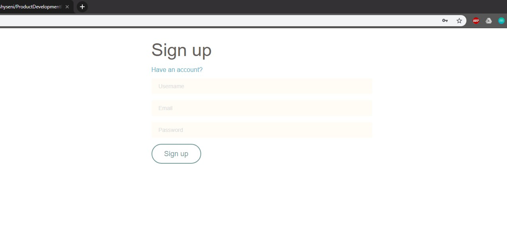
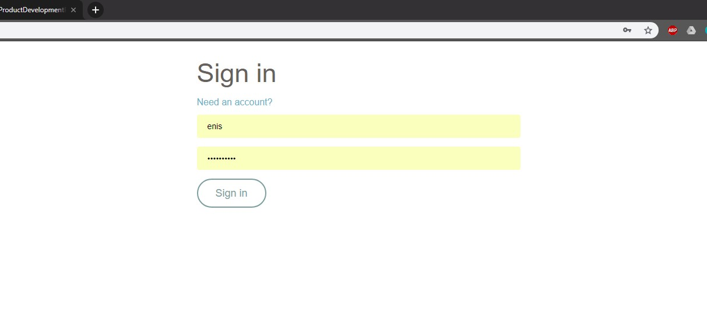
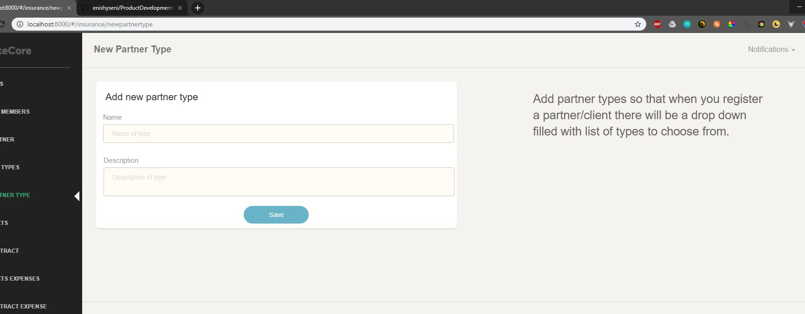
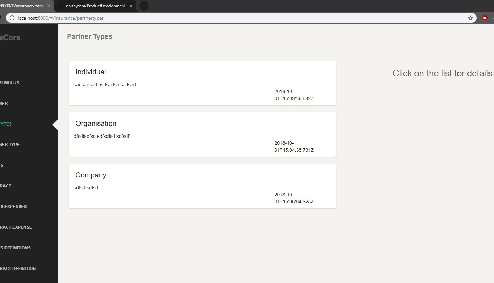
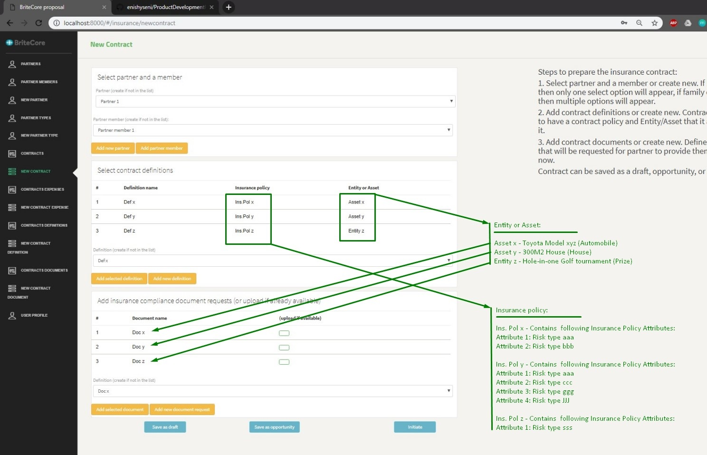
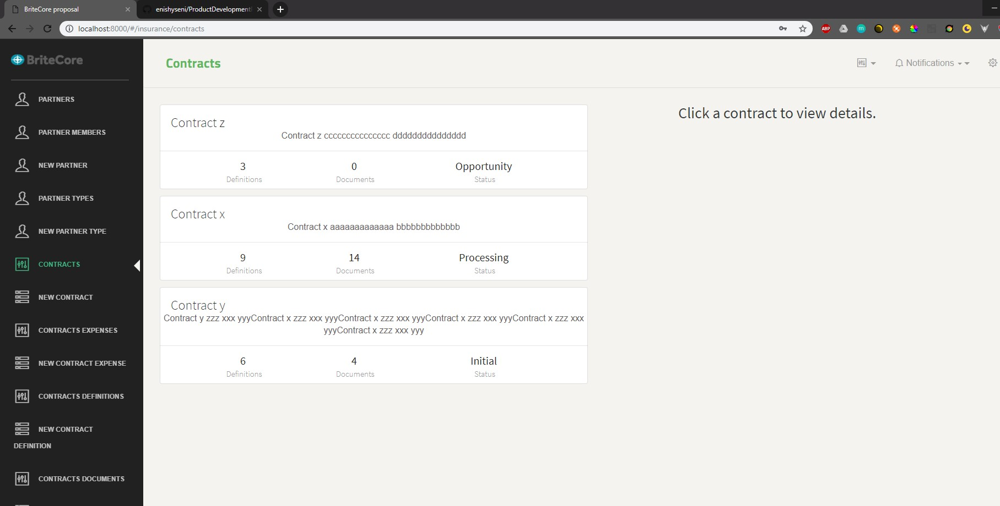
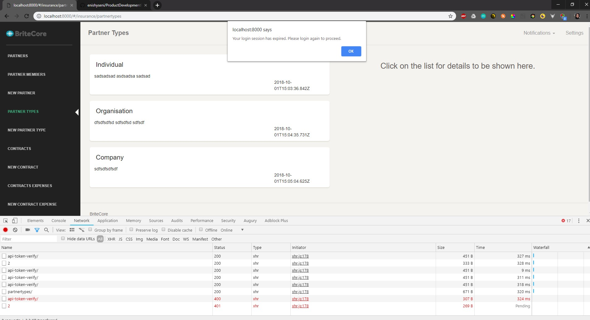

# BriteCore solution proposal

### Before we begin

This solution comes from an experienced software engineer who had zero experience with insurance platforms before, and since Python/Django/VueJS is not my primary technology stack, it took me a bit more time to get familiar with this stack, either way it wasn't that hard because software engineering principles are very similar in modern technology stacks.

### The idea

I have read and asked a bit about how insurance companies work, and a bit of personal experience with medical insurance, i came with a proposal that i thought might cover "all" the cases in insurance business model.

### Platform design concept

I started with a simplified process flow in my mind, meaning the first thing you encounter with insurance company is identification, to whom i might be an organisation or individual which therefore i called it Partner in the solution. Since this was created to demonstrate solution giving aproach through Python/Django/VueJS stack it therefore lacks business logic, because to make it fully functional it would require most likely another month or two to finish it.

#### Partner: 
###### It's where we save basic data about the client/partner.

#### PartnerType: 
###### Two categories that i already mentioned for Partner type are organisational or individual.

#### PartnerMember: 
###### As the name implies, if partner is of type organizational then it may have many member or staff and those staff members might be treated differently when it comes to entities/assets they are insuring. Contract: to make an agreement with Partners(our clients) we use contracts as a wrapper for our detailed cases, whether the Partner wants to ensure an automobile, house, cyber liability, or prizes.

#### ContractDefinition: 
###### Contract can have many contract definitions and contract definitions are probably the core part which makes this solution proposal along with InsurancePolicies. Because a single contract definition contains insurance policies apllied for atomic part of contract that defines a policy related to partner members and entity/asset assigned to it.

#### ContractDefinitionUploadedDocument: 
###### This is where we save documents provided by client/partner, depending on documents definitions from InsuranceTypeComplianceDocument model. 

#### ContractStatus: 
###### Contract will have a lifecycle described in statuses. For example, initially a contract can be defined as opportunity or initial, then throughout time will change into processing state, confirmed, active, or even canceled state/status.

#### ContractExpense: 
###### This can be applied to medical type of insurances where client/partnermember can declare expenses that will be covered by insurance according to ContractDefinition and InsurancePolicy.

#### ContractExpenseDocument: 
###### When client/partner declares expenses that should be covered by insurance contract it needs to provide documents as a proof.

#### InsurancePolicies: 
###### There are template insurancepolicies and those defined specifically whenever a contract definition is added to contract. Insurance policy is bound to every contract definition, meaning that contract can contain muliple insurance policies alonside contract definitions.

#### InsurancePolicyAttribute: 
###### Just as the name implies, an insurance policy can have multiple attributes that can further extend an insurance policy.

#### InsuranceMetaType: 
###### Insurance meta types define a "static" meta types that when combined with InsuranceTypes can more precisely describe rules applied to insurance policies. Example: Life Insurance or Personal Insurance, Property Insurance, Marine Insurance, Fire Insurance, Liability Insurance, Guarantee Insurance, Social Insurance.

#### InsuranceType: 
###### Extended definitions for InsuranceMetaTypes, for example, a Property Insurance can be an automobile, house, or any asset related to organisation or individual.

#### InsuranceTypeComplianceDocument: 
###### Definitions for documents that are required in order for ContractDefinitions to be valid.


Visual representation of models in this solution (generated by python-graphviz, context named "et" which refers to models.py in this solution)




To this point we talked about backend engine on django and the way it handles data. Some other points worth mentioning are django authentication used in this project which is of type rest jwt token based. Since this solution is for demonstrative purpose and to give a general idea about the approach on this subject, i havent included any database other than local database db.sqlite3 on which i used “python manage.py makemigrations” to reflect the models from models.py.


When it comes to Frontend, I’ve used a free “admin theme” made on VueJS and changed the navigation on router and components to give the idea on how i would organize a frontend engine. One thing that you can notice on components are simple layout for every model that contains 2 file, one that lists records from that model and one that inserts new record on that model.

I had a bit of a struggle when integrating Webpack with Django through "webpack-stats.json" because of the configuration and folder structure that needed to be changed, thats why the main project folder looks like it contains many files and folders since i had to put VueJS and Django in the same folder. This could have been done the other way but it would take a little bit more time to configure Webpack to target files into specific folders. 

There is api.service.js which handles all data exchange between client and server. It uses Vue Axios for simplification of data exhchange. On every request JWT token is injected for authentification on Django endpoints.

### What we achieve by this solution?

This data model allows us to make a system that when a customer wants to insure their car or house or prize, we can prepare a contract for him/her.

But first, in order to prepare a contract and do business with clients we will be predefining risk types in our system outside of contract context. Meaning long before contracts start to appear in our system, we will have risk types predefined so they are ready to be used whenever a contract is about to happen.

### How we define risk types in the system?

Risk types are defined in InsurancePolicies table. An InsurancePolicy will contain many attributes that we can call risk types definition. Example:
Let's say we want to define template InsurancePolicies about cars and houses:

Insurance Policy x: 
Name - CAR
Attributes:
            1. Risk type x
            2. Risk type y
            3. Risk type z

Insurance Policy x: 
Name - HOUSE
Attributes:
            1. Risk type x
            2. Risk type a
            3. Risk type b
            4. Risk type c
            5. Risk type g

From the examples we see that the contract with customer that wants to insure a car and a house will have 8 risks involved.

### What does this proposal covers so far?

1. Parties involved.
2. Contract definitions that define risk types through insurance policies.
3. InsurancyPolicy can contain many risk types definitions ion a form of attributes attached to a policy that can be used to attach them to entities or assets like automobiles, houses, or prizes on any ContractDefinition.
4. Documents that are required by the contract and risks involved
5. After Contract becomes active we can continue to attach expenses to this contract from the first day of it's effectivness untill the end of contract.

### How this idea will work in a real step by step scenario? House insurance example:

1. We register a customer as a private or company. In this case it's a private so it will have one member which is going to be the owner of house itself.
2. We prepare contract definitions.
3. By preparing contract definition we attach insurance policies that contain one or many predefined risktypes. In this case the contract definition will contain an InsurancePolicy defining risk types about house insurance. One contract definition is enough in this case to cover all the risks.
4. We define documents that the customer needs to present in order for the contract to be valid.
5. After all documents provided, whatever happens in contract period, if for example there was a risk involved that led to house being burned by accident, then we register expenses in ContractExpenses that BriteCore had to cover/pay the client.

### Screenshots

Register view component


Login view component


Form example (working example)


Listing example (working example)


Mockup example of contracts (HTML/CSS only. Not functional because of many constrains in models)


Mockup example of contracts list (HTML/CSS only. Not functional because of many constrains in models)


Before every action JWT token is validated. If expired it then redirects you to login screen.



```
How to run the example:
Download and install Python (2.7):

Install PIP:
python -m pip install -U pip
pip install -r requirements.txt

Download and install Node:
npm install
npm run build

Start example by:
python manage.py runserver

Navigate to http://localhost:8000

DOCKER VERSION:
docker pull nikolaik/python-nodejs:latest
docker build -t testproject .
docker run -p 8000:8000 testproject

Note:
Theres already data in database with superuser created but use the register form to create new account.
```


--------------------------Above this line is my solution proposal--------------------------


# Product Development Hiring Project

This outlines a recent problem we ran into and came up with a development solution for. We'd like to see how you would handle it. What is most important is gaining some insight into your development process and seeing how you work.

## Background

[BriteCore](http://www.britecore.com/) is a web-based platform insurance companies use to manage their business. Insurance is a form of risk management. Risks are anything that someone could incur a loss on. BriteCore has historically worked primarily with property-based risks (homes, farms, churches, etc.).

## Problem

Since BriteCore was created to work mostly with property-based insurance, the data model is pretty rigid. The data model assumes that all risks are properties and have addresses. This makes it difficult for BriteCore to work with different forms of insurance like Automobile Policies, Cyber Liability Coverage (protection against hacking), or Prize Insurance (if someone gets a $1 million hole-in-one prize at a golf tournament, the golf course doesn't pay it, they have an insurance policy to cover them).

## Primary Goal

In a github repo, we would like to see you come up with a solution that allows insurers to define their own custom data model for their risks. There should be no database tables called `automobiles`, `houses`, or `prizes`. Instead, insurers should be able to create their own risk types and attach as many different fields as they would like.

Fields are bits of data like first name, age, zip code, model, serial number, Coverage A limit, or prize dollar amount. Basically any data the carrier would want to collect about the risk. Fields can also be of different types, like text, date, number, currency, and so forth.

### Data

For the data layer, model the risk types and how the generic fields and field types would relate to these risk types. Field types should be either `text`, `number`, `date`, or `enum` (where there are multiple potential options but only one choice can be made).

Deliverables will be either...

1. A Python file containing the ORM classes for these tables.
2. An entity relationship diagram, which depicts the tables and their relationship to one another.
3. Both 1 and 2, because you're awesome.

### Backend

For the backend, create two API endpoints. One that returns a single risk type and one that returns a list of all risk types. Include all of the risk types' fields, field types, and any other data about the fields. This is your chance to show that you know how to create clean REST APIs.

Deliverables will be...

1. A well-tested REST API written in Python. **Bonus points** if you use Django.

### Frontend

The frontend is all about collecting information as it relates to these generic models. Create a single page that hits your risk type API endpoint(s) and displays all of the fields to the user in a form. Be sure to display at least one field of each type on the page. Don't worry about submitting the form.

Fields should use appropriate widgets based on their type. `text` fields should display as text boxes, `date` fields should use date pickers, and so on.

Deliverables will be...

1. A modern JavaScript app. **Bonus points** if you use ES6 and a modern JavaScript framework. **Mega bonus points** if you use Vue.js specifically.

## Questions

For questions, please use the contact email you were provided in the hiring step that brought you to this repo.

## Finished?

When you're done with the above project, please send us an email with the following:

- Links to your GitHub repo with your solution
- A link to a hosted instance of your application
- Your updated resume

The target address is the contact email you were provided in the hiring step that brought you to this repo.

1. **Bonus points** if you also orchestrate the launch environment in AWS using CloudFormation.
2. **Mega bonus points** if you host the app in [AWS Lambda](https://aws.amazon.com/lambda/) using [Zappa](https://github.com/Miserlou/Zappa) or [AWS ECS](https://aws.amazon.com/ecs/) using [AWS Fargate](https://aws.amazon.com/fargate/).

## Evaluation

If you'd like to do very well on this project, we'll hand you the categories we utilize to score candidates! They are:

1. Business requirements are met or exceeded
2. Documentation is clearly written
3. Django is PEP8 compliant and avoids antipatterns
4. Vue.js contains appropriate ViewModels and DOM interactions
5. CSS Framework is utilized correctly
6. Test coverage is complete and meaningful
7. Deployment is fully scripted
8. Communication is positive and respectful
